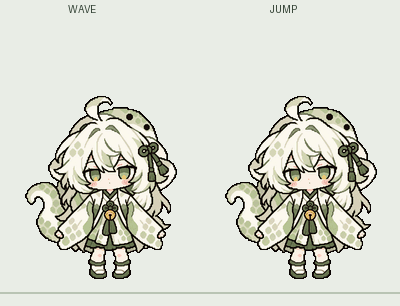
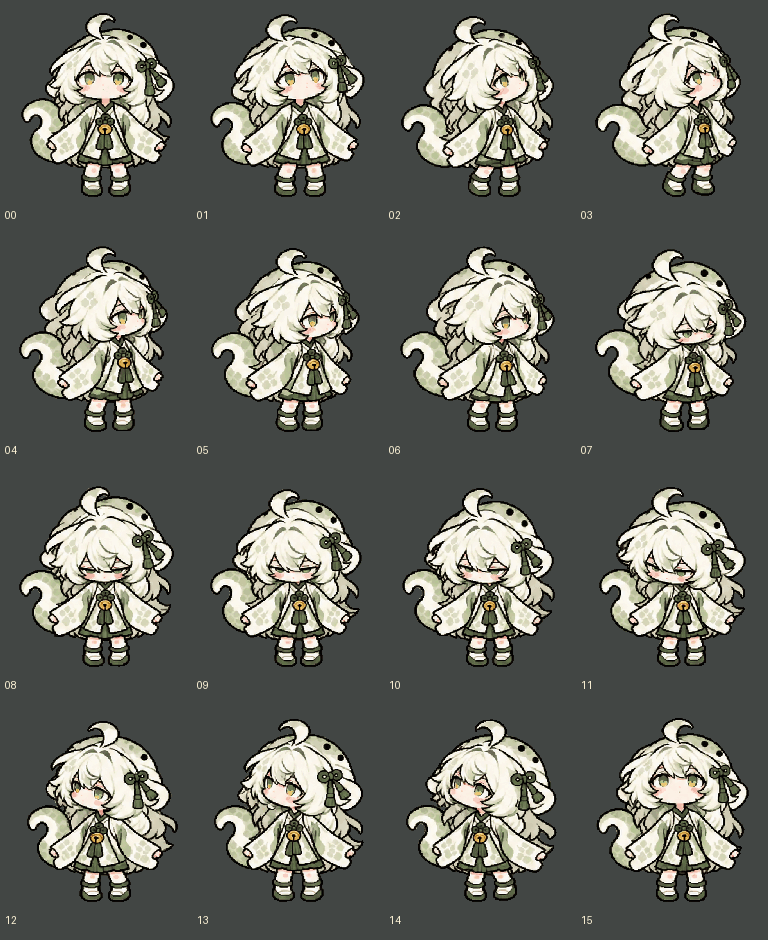

# 霖铃 Linling Desktop ver0.3

霖铃是一款运行在 Windows 桌面上的陪伴型桌宠。她会在桌面上注视鼠标、回应点击与拖动，也能连接你选择的大语言模型，在身旁的气泡中聊天，并根据相处过程逐步整理记忆。

> [!IMPORTANT]
> **霖铃不附带模型服务或公共 API Key。聊天功能必须由使用者自行准备并填写模型服务商提供的 API Key。**
>
> 你还需要填写对应的 API 地址和完整模型名称。未配置模型时，桌宠动画、鼠标跟随、点击、拖动、贴边和托盘功能仍可正常使用，但无法进行模型聊天、个性化主动问候和自动记忆整理。

## 下载与启动

1. 在本仓库右侧 **Releases** 下载 `Linling-Desktop-ver0.3-Windows.zip`。解压后即可找到 `Linling.exe`；源码构建的免解压程序会放在 `运行预览/ver0.3`。
2. 将压缩包完整解压到一个固定文件夹。
3. 双击 `Linling.exe` 启动。
4. 右键霖铃，选择「设置」，完成模型连接配置。

运行环境：

- Windows 10 或 Windows 11
- .NET Framework 4.8
- 如需聊天，需要可以访问所选模型服务的网络环境

升级时请先退出正在运行的旧版本，再解压和启动新版本。

ver0.3 将视线追随重做为 16 张完整人物姿势。偏头、抬头或低头时，面部、颈肩、衣领、衣袖、衣摆和腿部来自同一张完整画面，不再沿脖颈把头部拼到待机身体上。所有方向使用共同的缩放基准与脚底线；程序按每秒 24 帧逐方向转动，限制快速移动鼠标时的跨方向跳帧，鼠标停止后再循序回到待机。思考与观察仍各为 96 帧、约四秒。顶部倒挂尾巴、待机呼吸、挥手、奔跑、跳跃、攀爬、坠落和坐姿保留原有互动方式。图集继续使用 192×208 像素网格、原色板和硬边透明轮廓。

[查看挥手与跳跃关键帧](预览/wave-jump-keyframes.png)

[并排查看挥手的 11 种完整姿势](预览/wave-11-poses-v07.png)

[查看 16 向视线循环](预览/gaze-sweep-v10.gif) · [查看快速转向压力预览](预览/gaze-sweep-fast-v10.gif) · [思考动作](预览/thinking-v09.gif) · [观察动作](预览/observing-v09.gif) · [顶部尾巴摆动](预览/top-tail-v09.gif)

[并排查看思考与观察的七个姿势节点](预览/action-keys-v09.png)

源代码重建图集时，依次运行 `源码/extract_gaze_v10.py`、`源码/build_character_v05.py` 和 `源码/build_motion24.py`，最后运行 `源码/build_preview.ps1 -Version 0.3`，即可在 `运行预览/ver0.3` 得到未压缩的可运行文件夹。构建需要 Python、Pillow 和 NumPy；直接使用下载的 Windows 程序不需要这些构建依赖。

## 配置自己的模型

打开「设置 → 模型连接」，依次填写：

| 配置项 | 应填写的内容 |
| --- | --- |
| API 地址 | 模型服务商提供的 OpenAI 兼容 Chat Completions 地址。可以填写通常包含 `/v1` 的基础地址，也可以填写完整的 `/chat/completions` 地址。 |
| 模型名称 | 服务商提供的完整模型 ID，必须与该账号拥有的模型权限一致。 |
| API Key | 由你自己在模型服务商处申请的密钥。不要填写示例文字，也不要使用他人的密钥。 |
| 流式回复 | 开启后，霖铃会逐字显示模型返回的内容。 |
| 超时时间 | 深度思考模型响应较慢时，可以适当调高。 |

填写完成后，先点击「测试连接」。测试成功再保存设置并开始聊天。如果测试失败，请优先核对 API 地址、模型名称、密钥权限、可用额度和网络连接。

霖铃面向 OpenAI 兼容的 Chat Completions 接口设计。不同服务商的地址、模型 ID 和权限规则并不相同，应以你所使用服务商的控制台与文档为准。

## 如何与霖铃互动

### 鼠标互动

- **移动鼠标**：霖铃会以 16 个方向偏头、抬头、低头并注视指针，呼吸动画仍会继续。
- **单击霖铃**：播放挥手动作。
- **双击霖铃**：播放跳跃动作。
- **左右拖动**：播放大步跑动动画。
- **向上拖动**：播放攀爬动画。
- **向下拖动**：播放坠落动画。
- **拖至屏幕边缘**：根据所在边缘进入探头、倒挂或任务栏坐姿。
- **右键选择「预览 · 睡觉」**：霖铃蜷成一团缓慢呼吸，直到再次点击将她唤醒。

右键菜单可以直接预览不同动作。预览过程中再次点击任意位置，即可回到默认互动状态。

### 对话方式

- 从右键菜单打开聊天或显示输入框。
- 输入框可以展开、收起、拖动或完全隐藏。
- 回复会显示在霖铃身旁的气泡中，并在设定的停留时间后自动消失。
- 完整对话仍可在对话记录窗口中查看。
- 模型回复期间，霖铃会持续播放思考状态，直到回复完成或被停止。

## 陪伴强度

「陪伴与动画」提供三档主动陪伴强度：

- **安静**：不主动问候，也不随机表演动作；主动点击、拖动和聊天不受影响。
- **标准**：约每 30 分钟进行一次问候，并以正常频率随机眨眼、思考、观察、挥手或短暂打盹。
- **活泼**：约每 20 分钟进行一次问候，随机动作出现得更频繁。

可以开启「全屏应用运行时暂停主动陪伴」，避免游戏、演示或全屏视频期间出现主动气泡和动作。

## 人设与说话方式

霖铃将以下四类设置共同用于每次回答：

- **人设 / 身份**：角色身份、与用户的关系和基本背景。
- **性格**：情绪倾向、价值观和相处方式。
- **说话方式**：语气、回复长度、口癖和表达习惯。
- **通用知识 / 世界观**：希望角色始终了解的背景信息。

设置页可以预览实际组合后的角色提示词。固定人设的优先级高于相处过程中生成的成长补充。

## 对话记忆

启用记忆后，霖铃会按照设定的对话轮数调用当前模型，对已完成的对话进行整理。记忆分为固定记忆、短期内容、长期内容、日记和成长补充。

新提炼出的事实会列在「记忆手册 → 可核查记忆」中：

1. 选择一条记忆，可以查看它引用的原始对话。
2. 内容准确时选择「确认」。
3. 内容错误或不希望继续使用时选择「驳回」。
4. 需要以后再判断时，可以恢复为「待核查」。

你也可以手动编辑固定记忆，或清空生成的记忆。自动整理会额外调用一次当前配置的模型服务。

## 动画与桌面设置

可以在设置中调整：

- 桌宠大小与动画速度
- 互动动作持续时间
- 随机动作的最短和最长间隔
- 平均眨眼间隔
- 回复气泡停留时间
- 是否始终置顶
- 是否跟随鼠标转头
- 是否显示颜文字和状态动效
- 是否登录 Windows 后自动启动

系统托盘菜单可用于重新显示霖铃、打开聊天与设置，或完全退出程序。

## 常见问题

### 不填写 API Key 能使用吗？

可以使用桌宠动画和离线互动，但不能与模型聊天，也不能生成个性化问候或整理新记忆。聊天功能没有内置免费模型，必须配置自己的模型服务。

### 为什么测试连接失败？

请确认 API 地址采用服务商要求的格式、模型 ID 完整正确、API Key 有对应权限且账号仍有可用额度。本机网络也必须能够访问该服务。

### 为什么回复速度比较慢？

速度主要由所选模型、服务商负载、网络和模型是否启用深度思考决定。可以增加等待超时时间，或改用响应更快的模型。

### 如何临时减少打扰？

将陪伴强度设为「安静」，或开启全屏暂停。也可以从右键菜单隐藏输入框或将霖铃收进系统托盘。

### 如何彻底退出？

右键霖铃或托盘图标，选择「退出」。仅关闭聊天窗口不会结束桌宠进程。
